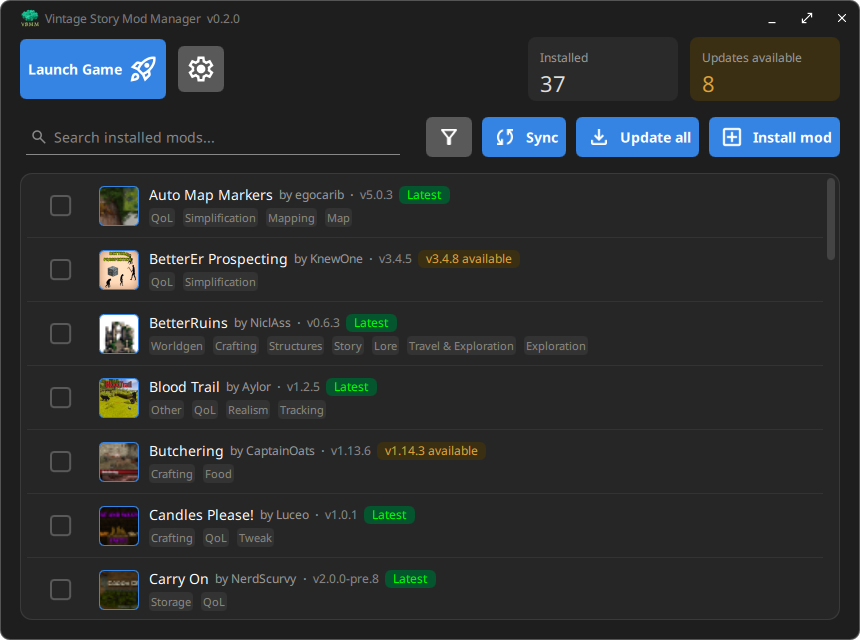
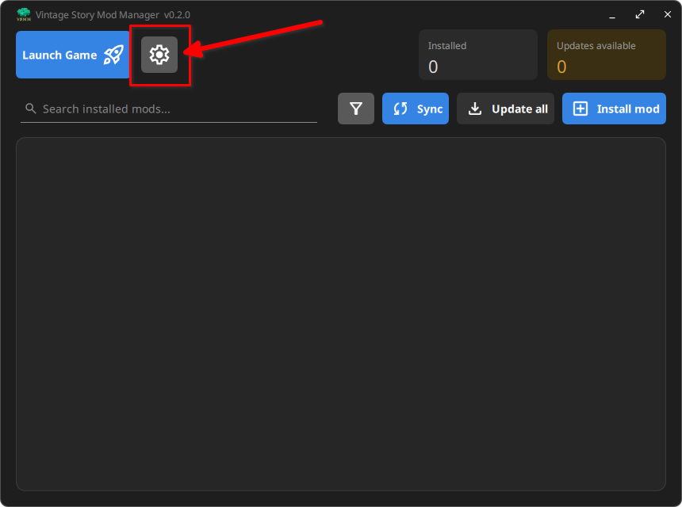
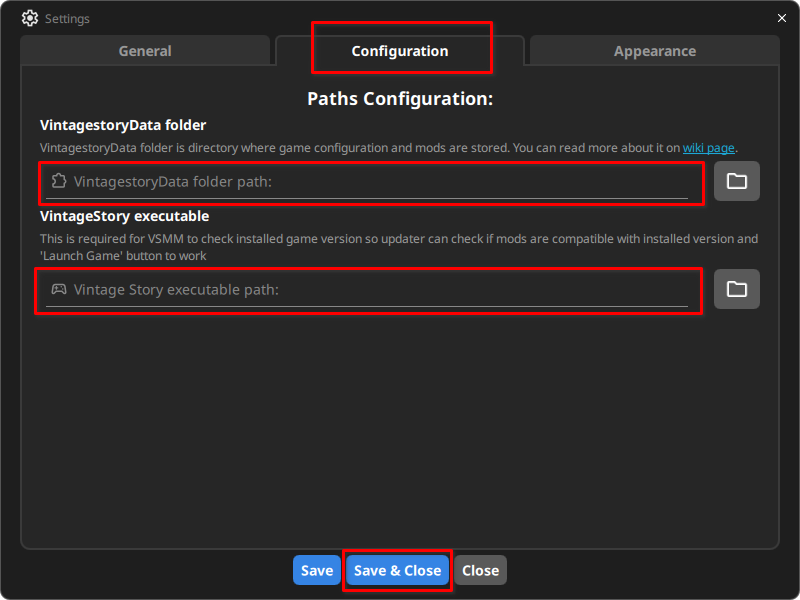

<h1 align="center"><b>Vintage Story Mod Manager (VSMM)</b></h1> 

<div align="center">

<!-- This will be uncommented when repo will go public


-->


</div>

---
<div align="center">
  
**A fast, lightweight desktop manager for [*Vintage Story*](https://www.vintagestory.at/) mods.**

VSMM scans your local mods folder, cross-references each installed mod against the
official [Vintage Story mod API](https://mods.vintagestory.at/), and shows you at a
glance which mods have updates available, all inside a custom, frameless, dark-themed UI.

---



---

</div>

## Features:

- **Automatic scanning** of your local `Mods` folder
- **Update detection** - compares installed versions against the latest release in [ModDB](https://mods.vintagestory.at/)
  via semantic versioning
- **Rich mod list** with icons, authors, tags, and update badges
- **Updating mods** - with option to update all/selected/single mod.
- **Instant search, sort, and filter**
- **Add mods from the GUI**
- **Custom frameless dark UI** built with Qt6

> [!IMPORTANT]
> Vintage Story Mod Manager is currently Under Development. Some things may not work, some may not be implemented yet. If you encounter any bugs, please file a bug report as an issue.

---

# Installation

> [!NOTE]
> All release artifacts (installers, packages, archives) are built and published automatically by [GitHub Actions](https://github.com/FoxTale-Group/VSMM/actions) directly from the tagged source code in this repository, never assembled by hand on a developer's own machine. You can inspect the exact [release workflow](.github/workflows/release.yml) and every build log yourself. Releases are also published as immutable, so once a version goes out, its artifacts can't be altered or replaced afterwards by anyone, including us.

> [!CAUTION]
> After starting go to app settings and setup path to `VintagestoryData` folder. See [After Installation](#after-installation)

## Minimal Requirements

### Supported Operating Systems:
> [!NOTE]
> Currently only 64bit x86 CPU Architecture is supported
- Windows 10 22H2 x86_64 or newer
- Windows 11 24H2 x86_64 or newer
- Ubuntu 26.04 LTS or newer
- Fedora 42 or newer
- Arch Linux

> Other Linux distributions that aren't mentioned here but are based on supported versions of distros mentioned above are also supported as long as they have support for Qt 6.10 or newer

### Runtime Dependencies
- [Qt 6.10](https://wiki.qt.io/Qt_6.10_Release) or newer
- [libzip](https://libzip.org/) 

---

## Windows

Go to [releases page](https://github.com/FoxTale-Group/VSMM/releases/latest) and download the latest Windows release:
- `vintagestory-mod-manager-{version}-win64-installer.exe` - Installer created with [NSIS](https://nsis.sourceforge.io/Main_Page) or
- `vintagestory-mod-manager-{version}-win64-portable.zip` - prebuilt portable version that doesn't require installation

> [!WARNING]
> You'll likely see a "Windows protected your PC" (SmartScreen) warning when running the installer. 
> This is expected and not a sign that VSMM is unsafe: 
> Microsoft only skips this warning for developers who pay for and register an official code-signing certificate, which isn't something a small open-source project can justify. 
> Any unsigned installer from a small or new publisher triggers the same warning, regardless of how safe it actually is.
>
> To continue: click **More info**, then **Run anyway**.
>
> VSMM is fully open source, so if you'd like to verify what you're installing yourself, you're welcome to read the source code or build it from source (see [Building from source](#building-from-source)).

<details open>
<summary><h3>Installer steps:</h3></summary>

1. Download `vintagestory-mod-manager-{version}-win64-installer.exe` from latest release
2. Run the installer.
3. Proceed with installer
4. After installation is complete, launch VSMM via desktop shortcut or by searching it in Start Menu

</details>

<details open>
<summary><h3>Portable:</h3></summary>

1. Download `vintagestory-mod-manager-{version}-win64-portable.zip`
2. Unzip the archive using your favorite archive manager (we recommend [7-zip](https://www.7-zip.org/) as it's free and open source)
3. Navigate to `/bin` directory and run `VSMM.exe`
4. (optional) Right click on `VSMM.exe` and `Create desktop shortcut` for easy access.

</details>

---

## Linux

Go to [releases page](https://github.com/FoxTale-Group/VSMM/releases/latest) and download the latest stable package for your distribution.

> [!TIP]
> On Ubuntu/Fedora based systems with GNOME or KDE Plasma you can double-click the `.deb` or `.rpm` file to open it using GNOME's Software Center or KDE's Discover for graphical installation.

> [!IMPORTANT]
> Replace `{version}` with actual version number in commands below.

<details>
<summary><h4>.deb package (Ubuntu based distros)</h4></summary>

```bash
# Download .deb package from releases page or using curl in terminal. 
curl -O https://github.com/FoxTale-Group/VSMM/releases/download/{version}/vintagestory-mod-manager-{version}-Linux.deb

# Install
sudo apt install ./vintagestory-mod-manager-{version}-Linux.deb
```

</details>

<details>
<summary><h4>.rpm package (Fedora based distros)</h4></summary>

```bash
# Download .rpm package from releases page or using curl in terminal. 
curl -O https://github.com/FoxTale-Group/VSMM/releases/download/{version}/vintagestory-mod-manager-{version}-Linux.rpm

# Install
sudo dnf install ./vintagestory-mod-manager-{version}-Linux.rpm
```

</details>

<details>
<summary><h4>TAR.GZ / TAR.XZ Archive (Any distro)</h4></summary>

1. Download tar archive from releases page or using curl:

```bash
# tar.gz
curl -O https://github.com/FoxTale-Group/VSMM/releases/download/{version}/vintagestory-mod-manager-{version}-Linux.tar.gz

# tar.xz
curl -O https://github.com/FoxTale-Group/VSMM/releases/download/{version}/vintagestory-mod-manager-{version}-Linux.tar.xz
```
2. Unpack it:
```bash
# tar.gz
tar -xzf vintagestory-mod-manager-{version}-Linux.tar.gz

# tar.xz
tar -xJf vintagestory-mod-manager-{version}-Linux.tar.xz
```
3. Launch the app:
```bash
chmod +x vintagestory-mod-manager-{version}-Linux/usr/bin/VSMM
./vintagestory-mod-manager-{version}-Linux/usr/bin/VSMM
```

</details>

<details>
<summary><h4>AppImage (Any distro)</h4></summary>

```bash
# Download AppImage from releases page or using curl in terminal. 
curl -O https://github.com/FoxTale-Group/VSMM/releases/download/{version}/vintagestory-mod-manager-{version}-x86_64.AppImage

# Allow permission to executing and launch
chmod +x vintagestory-mod-manager-{version}-x86_64.AppImage
./vintagestory-mod-manager-{version}-x86_64.AppImage
```

</details>

---

## After Installation

On the first launch you need to 'tell' VSMM where is the game data folder and its executable file so it can see your mods, game version and also launch it.

1. Go to settings.

    

2. Switch to "Configuration" tab and paste there paths to `VintagestoryData` folder and game exe
    

> [!TIP]
> If you're using flatpak version of Vintage Story you can point the path to either shortcut or directly to path where Flatpak's executable is located. If installed as system-wide it's typically located under `/var/lib/flatpak/app/at.vintagestory.VintageStory/x86_64/stable/active/export/bin/at.vintagestory.VintageStory`. You can check exact path by right clicking Desktop Entry in `~/.local/share/applications/at.vintagestory.VintageStory.desktop` and clicking `Show target` or similar option.

---

# Building from source

### Requirements:

- A C++23-capable compiler
- [CMake](https://cmake.org/) ≥ 4.2 and [Ninja](https://ninja-build.org/)
- [Qt 6](https://www.qt.io/) - `Core`, `Quick`, `Qml`, `Network`, `QuickControls2`
- [libzip](https://libzip.org/)

## On Linux:

Install required build dependencies using your distribution package manager.
```bash
# For Arch:
sudo pacman -S cmake ninja qt6-base qt6-declarative libzip 

# For Ubuntu:
sudo apt install cmake ninja-build qt6-{base,declarative}-dev libzip-dev

# For Fedora:
sudo dnf install cmake ninja-build libzip-devel qt6-qtbase-devel qt6-qtquickcontrols2-devel
```

#### Building

```bash
git clone https://github.com/FoxTale-Group/VSMM.git
cd VSMM
cmake -G Ninja -S . -B build-dir -DCMAKE_BUILD_TYPE=Release && cmake --build build-dir
```
> [!NOTE]
> For an optimized build, use `-DCMAKE_BUILD_TYPE=Release` and a matching build directory.
> Use `-DCMAKE_BUILD_TYPE=Debug` for more detailed verbose logs.
> You can name your `build-dir` whatever you like.

## On Windows:

Install required build dependencies:
- [Visual Studio 2022 Community](https://visualstudio.microsoft.com/) (or the standalone Build Tools) with the **Desktop development with C++** workload
- [Qt 6.10](https://www.qt.io/download-qt-installer) with the `MSVC 2022 64-bit` component
- [CMake](https://cmake.org/download/) and [Ninja](https://github.com/ninja-build/ninja/releases), or install both via:
```powershell
winget install Kitware.CMake Ninja-build.Ninja
```
- [vcpkg](https://github.com/microsoft/vcpkg), for `libzip`. This repo ships a `vcpkg.json` manifest, so vcpkg installs `libzip` for you the first time you configure the project, you just need vcpkg itself on disk:
```powershell
git clone https://github.com/microsoft/vcpkg.git
.\vcpkg\bootstrap-vcpkg.bat
```

#### Building

Open a **x64 Native Tools Command Prompt for VS 2022** (search for it in the Start Menu) so `cl.exe` is available on `PATH`, then:

```bat
git clone https://github.com/FoxTale-Group/VSMM.git
cd VSMM

cmake -G Ninja -S . -B build-dir ^
  -DCMAKE_BUILD_TYPE=Release ^
  -DCMAKE_C_COMPILER=cl -DCMAKE_CXX_COMPILER=cl ^
  -DCMAKE_PREFIX_PATH="C:\Qt\6.10.0\msvc2022_64" ^
  -DCMAKE_TOOLCHAIN_FILE="C:\path\to\vcpkg\scripts\buildsystems\vcpkg.cmake"

cmake --build build-dir --config Release
```

> [!NOTE]
> Replace `CMAKE_PREFIX_PATH` with wherever the Qt installer put your `6.10.0\msvc2022_64` folder, and `CMAKE_TOOLCHAIN_FILE` with wherever you cloned vcpkg in the step above.

> [!IMPORTANT]
> The built `VSMM.exe` needs Qt's DLLs next to it to run. Either run `windeployqt build-dir\VSMM.exe` (ships with Qt, copies the DLLs it needs right next to the exe) or add Qt's `bin` folder (e.g. `C:\Qt\6.10.0\msvc2022_64\bin`) to your `PATH` before launching it.

---

# Roadmap

See the [project board](https://github.com/orgs/FoxTale-Group/projects/2/views/4) for the
full roadmap, list of planned features, ideas and bugs.

# Contributing

Contributions are welcome! Check [CONTRIBUTING.md](CONTRIBUTING.md)

# License

This project is licensed under the **GNU General Public License v3.0** —
see the [LICENSE](LICENSE) file for details.

## Acknowledgements

- The [Vintage Story](https://www.vintagestory.at/) team and modding community
- Built with [Qt](https://www.qt.io/), [libzip](https://libzip.org/),
  and [semver](https://github.com/Neargye/semver)
